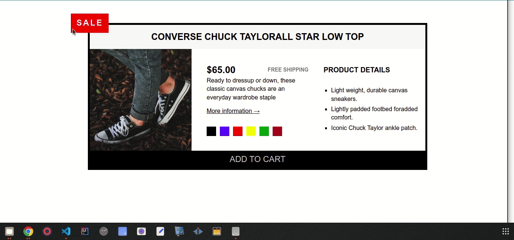

# Learning HTML and CSS

## Hello Everyone...

In this repo I show the very nice and simple website called `The Code Magazine` that was used to apply the concepts learned in the course
[Build Responsive Real-World Websites with HTML and CSS](https://www.udemy.com/course-dashboard-redirect/?course_id=437398) instructed by [Jonas Schmedtmann](udemy.com/user/jonasschmedtmann/) who's an amazing instructor btw.

## What I learned

The course isn't over yet, so far I only learned:

- ### Fundamentals of HTML
- ### Fundamentals of CSS

  - Basic styling CSS
  - Pseudo Classes
  - Pseudo Elements
  - Float Layout
  - Flex Layout
  - Grid Layout

- How to use Chrome Dev Tools
- And there was a challenge along the way that I had to do myself from scratch, I'll attatch a screenshot to it at the end of this file.

> The course is pretty fun so far, and what's coming is even more fun, we're gonna learna bout Web Design Rules and Framework, Components and Laout Patterns, then we'll build a pretty big project on the entire concepts that we learned in the course, pretty excited!

## Screenshot to the project

## Screenshot to the challenge tiny project

I'll upload the code to this challenge as well.

